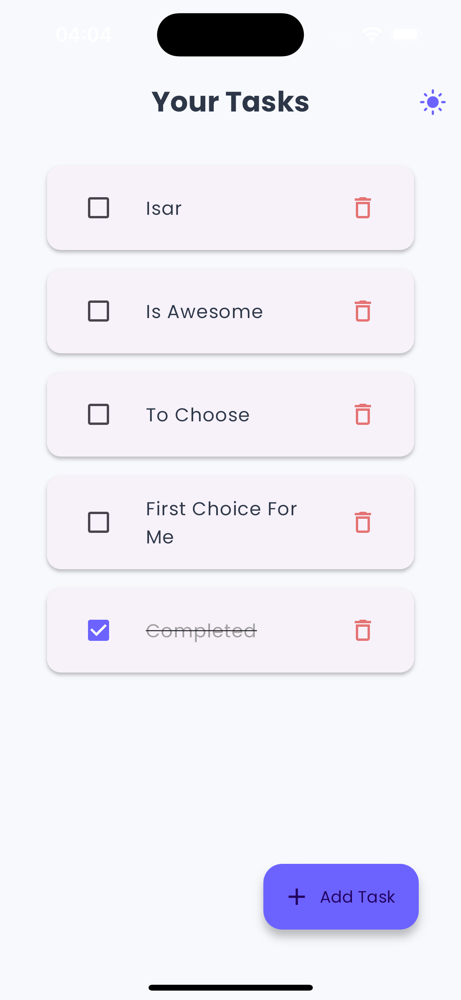
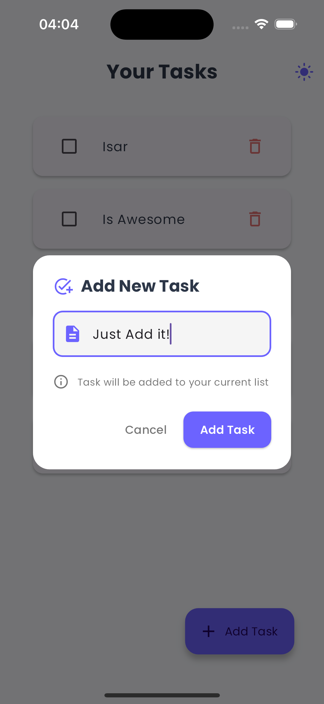

# Isar NoSQL Mini-Task App

A sleek and intuitive task management application built with Flutter, Cubit for state management, and Isar for local data storage.

## Features

- **Create and manage your daily tasks**
- **Mark tasks as complete**
- **Delete tasks**
- **Clean and modern user interface**
- **Offline storage using Isar database**

## Screenshots

  
  

### Main Task List

The main screen displays all your tasks in a clean, card-based layout. Each task can be marked as complete or deleted.

### Add New Task

Adding a new task is simple with our intuitive "Add New Task" dialog.

## Key UI Elements

- **Task Cards:** Each task is displayed in its own card, providing clear separation and readability.
- **Checkbox:** Tasks can be marked as complete with a simple checkbox.
- **Delete Option:** Each task has a delete option for easy removal.
- **Add Task Button:** A prominent "Add Task" button for quickly adding new tasks.
- **Theme Toggle:** Easily switch between light and dark modes with the theme toggle in the app bar.

## Technologies Used

- **Flutter:** UI toolkit for building natively compiled applications.
- **Cubit:** State management solution.
- **Isar:** Super fast cross-platform database for Flutter.

## Getting Started

To run this application:

1. Ensure you have Flutter installed on your machine.
2. Clone this repository.
3. Run `flutter pub get` to install dependencies.
4. Use `flutter run` to start the app on your connected device or emulator.

If this is your first Flutter project, here are some resources to get you started:

- [Lab: Write your first Flutter app](https://flutter.dev/docs/get-started/codelab)
- [Cookbook: Useful Flutter samples](https://flutter.dev/docs/cookbook)

For more comprehensive guidance on Flutter development, check out the [online documentation](https://flutter.dev/docs), which offers tutorials, samples, and a full API reference.
# Isar_usage_example_task_planner
